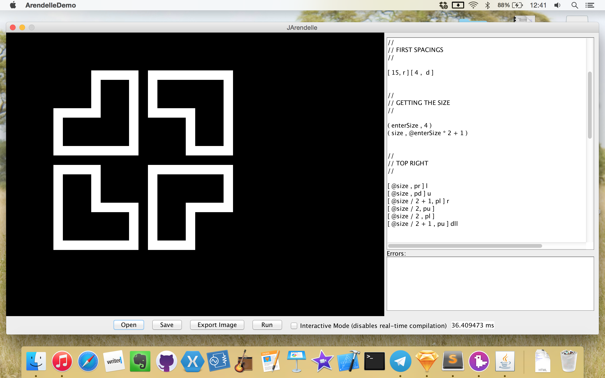

<br />

# BHRC Logo maker
This code renders a logo of BHRC in any given size. Which is very cool if you want the logo to be bold or light. To run the code you will need to have an [Arendelle Language](http://web.arendelle.org) IDE or Interpreter installed.


<br />

```
BHRC Logo Maker
Copyright (c) 2015 Pouya Kary <k@arendelle.org>


This program is free software: you can redistribute it and/or modify
it under the terms of the GNU General Public License as published by
the Free Software Foundation, either version 3 of the License, or
(at your option) any later version.

This program is distributed in the hope that it will be useful,
but WITHOUT ANY WARRANTY; without even the implied warranty of
MERCHANTABILITY or FITNESS FOR A PARTICULAR PURPOSE.  See the
GNU General Public License for more details.

You should have received a copy of the GNU General Public License
along with this program.  If not, see <http://www.gnu.org/licenses/>.
```